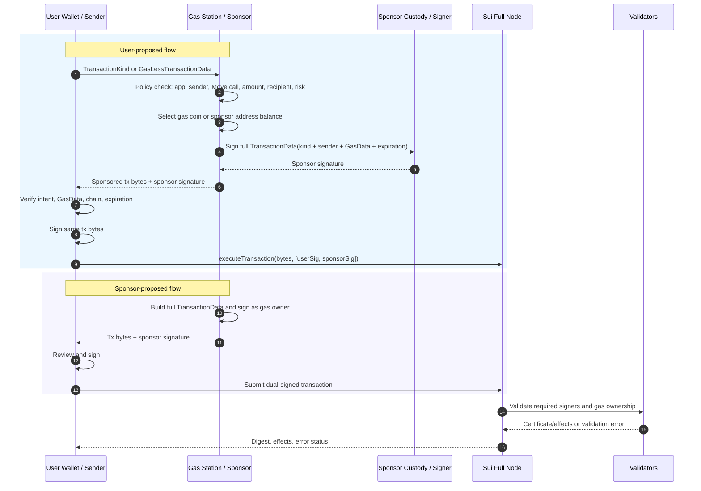
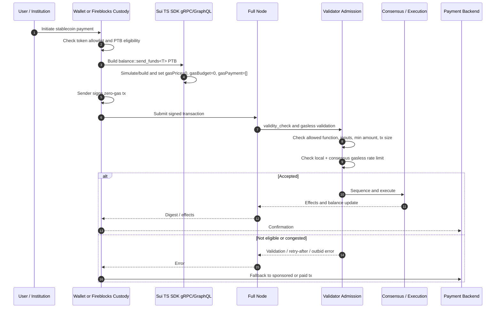
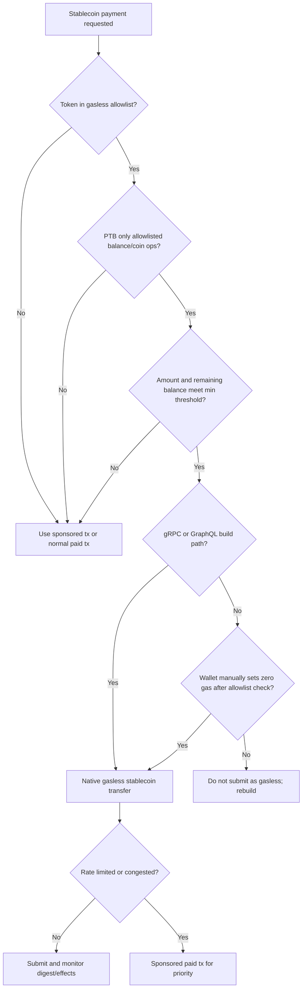
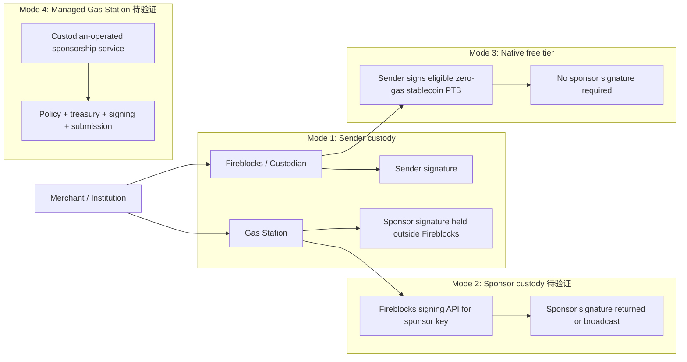

# Sui Gasless Transaction 机制原理分析

## Executive Summary

Sui 上的 "gasless" 至少有三层含义，产品设计时必须分开处理。

第一层是普通 sponsored transaction：业务交易的 `sender` 和 gas 付款方由协议数据结构分离。`TransactionDataV1` 同时包含业务 `TransactionKind`、`sender`、`GasData` 和 `expiration`；`GasData` 再携带 gas payment object 列表、gas owner、price 和 budget。源码把 `gas_owner != sender` 定义为 sponsored transaction，并要求 sender 与 gas owner 都是 transaction participants；官方文档也说明双签名覆盖完整 `TransactionData`，包括 `GasData`。[Sui docs: Sponsored Transactions](https://docs.sui.io/develop/transaction-payment/sponsor-txn), `crates/sui-types/src/transaction.rs` lines 2288-2293, 2374-2379, 2969-2975, 3475-3500.

第二层是 address-balance gas payment：`GasData.payment` 可以为空，表示 gas 从地址余额而非具体 gas coin object 支付。若 `owner` 是 sponsor，则 sponsor 的 address balance 支付 gas；这仍是 sponsored transaction，仍要求 sender 与 sponsor 双签名。它降低 gas coin inventory、object locking 和并发版本冲突，但引入 address balance 余额、`ValidDuring` replay protection、storage rebate 归属等工程要求。[Sui docs: Using Address Balances](https://docs.sui.io/onchain-finance/asset-custody/address-balances/using-address-balances), `crates/sui-types/src/transaction.rs` lines 2304-2317, 3603-3613.

第三层是 2026 年主网 free-tier gasless stablecoin transfers：它不是任意交易由某个 sponsor 代付，而是协议配置允许一类非常窄的 stablecoin PTB 以 `gasPayment=[]`、`gasPrice=0`、`gasBudget=0` 通过验证。当前实现把 allowlisted stablecoin type、最小剩余/转账单位、可调用 Move function、输入限制、交易大小、TPS 限制和拥塞优先级写在协议配置和 validator admission path 中。官方文档明确说拥塞时 paid transactions 优先，且 gasless stablecoin transfers 只覆盖 qualified stablecoin P2P transfer，不覆盖 SUI transfer、swap、NFT mint 或任意 app interaction。[Sui docs: Gasless Stablecoin Transfers](https://docs.sui.io/develop/transaction-payment/gasless-stablecoin-transfers), `crates/sui-protocol-config/src/lib.rs` lines 4944-4974, `crates/sui-types/src/transaction.rs` lines 996-1024, 1262-1387, 1513-1524, 3432-3469.

Fireblocks 在这个方案中的已证实角色应保守表述：Sui 官方博客称 gasless stablecoin transfers 发布获得 Fireblocks 支持；Fireblocks 公开资料可支撑 custody、policy、transaction API / raw signing / Gas Station 相关能力的泛化描述。但没有找到 primary source 证明 Fireblocks 当前会自动判断 Sui PTB free-tier eligibility、自动设置 Sui zero-gas 参数、或提供 "sponsor-sign-and-return" 这种精确 Sui Gas Station API。因此本文将 Fireblocks 写为托管、策略、签名和潜在 sponsor-key custody/managed sponsorship 的集成位置，并把未证实能力标为待验证。[Sui Blog: Sui Launches Gasless Stablecoin Transfers with Support from Fireblocks](https://blog.sui.io/sui-launches-gasless-stablecoin-transfers-with-support-from-fireblocks/), [Fireblocks Developers: Gas Station](https://developers.fireblocks.com/docs/work-with-gas-station), [Fireblocks Developers: Create transactions](https://developers.fireblocks.com/reference/create-transactions).

## Item Findings

### item-1: 协议数据模型：TransactionKind、TransactionDataV1 与 GasData 分离

**Finding.** Sui 的协议数据模型把业务 intent 和 gas 支付上下文拆开，但最终二者仍作为一个完整 `TransactionData` 被签名。`TransactionDataV1` 是 `kind + sender + gas_data + expiration`；`GasData` 是 `payment + owner + price + budget`。`TransactionKind` 描述 PTB 或系统交易本身，`GasData` 描述谁付 gas、用哪些 gas object/address balance、支付价格和预算。`required_signers()` 先加入 sender；如果 gas owner 与 sender 不同，再加入 gas owner。因此 sponsor 并不是 relayer API token，而是链上交易参与签名者。

**Source evidence.**

- Official docs show `SenderSignedTransaction`, `TransactionDataV1`, and `GasData` shapes, and state that `GasData.owner` owns the gas objects; when owner equals sender it is regular, otherwise sponsored. [Sponsored Transactions](https://docs.sui.io/develop/transaction-payment/sponsor-txn).
- Source defines `GasData { payment, owner, price, budget }`, `TransactionDataV1 { kind, sender, gas_data, expiration }`, `required_signers()`, and `is_sponsored_tx()`. `MystenLabs/sui@e09f31f...`, `crates/sui-types/src/transaction.rs` lines 2288-2293, 2374-2379, 2969-2975, 3475-3478.
- `check_sponsorship()` allows sponsorship only when `kind` is `TransactionKind::ProgrammableTransaction`; otherwise it returns `UnsupportedSponsoredTransactionKind`. `crates/sui-types/src/transaction.rs` lines 3491-3500.

**Mechanism distinction.**

| Mechanism | GasData shape | Signers | Scope |
|---|---|---|---|
| Normal paid tx | `owner == sender`, non-empty gas objects, or sender address balance | sender | General transaction path |
| Sponsored tx with gas objects | `owner == sponsor`, `payment` contains sponsor-owned gas object refs | sender + sponsor | PTB sponsorship only |
| Sponsored tx with address balance | `owner == sponsor`, `payment=[]`, positive gas price/budget | sender + sponsor | PTB sponsorship using sponsor SUI address balance |
| Native gasless stablecoin free tier | `payment=[]`, `price=0`, `budget=0` | sender only unless separately sponsored | Narrow allowlisted stablecoin transfer path |

**Confidence.** High. Source code and official docs match.

### item-2: Sponsored Transaction 签名流程与所有权协调

**Core signing rule.** Sponsored transaction signatures are over the full `TransactionData`, not only `TransactionKind`. Because `GasData` is included in the signed payload, neither a relayer nor a malicious full node can swap the sponsor gas object or budget after one party signs without invalidating signatures. The signature list order does not matter, but it must contain valid signatures from all required participants.

The source `SenderSignedTransaction` struct documents the participant-only and order-independent signature list. The docs explicitly state that sponsored transactions require both user and sponsor signatures in some order and that signatures cover the entire `TransactionData`, including `GasData`. Source `required_signers()` enforces sender plus gas owner when `gas_owner != sender`. [Sponsored Transactions](https://docs.sui.io/develop/transaction-payment/sponsor-txn), `crates/sui-types/src/transaction.rs` lines 2969-2975 and 3659-3668.

**Flow A: user-proposed sponsored transaction.**

1. Wallet/app builds a transaction kind or a `GasLessTransactionData` interface payload. Sui docs clarify `GasLessTransactionData` is an interface between user and sponsor, not a `sui-core` data structure.
2. User sends the gasless payload to a Gas Station/sponsor.
3. Sponsor validates app, sender, target packages/functions, amount, recipient, risk rules and object references.
4. Sponsor constructs full `TransactionData` by setting sender, gas owner, gas payment, gas price/budget and expiration; then sponsor signs.
5. Sponsor returns signed bytes and sponsor signature to the user.
6. User re-verifies business intent plus gas owner/budget/expiration/chain, signs the exact same bytes, and submits through a full node or sponsor.

**Flow B: sponsor-proposed sponsored transaction.**

1. Sponsor constructs a complete `TransactionData` for a user action, including gas details.
2. Sponsor signs and sends transaction bytes/signature to user.
3. User reviews and signs.
4. Either user or sponsor submits the dual-signed transaction.

**SDK pattern.** For PTBs, the TypeScript builder supports `onlyTransactionKind` to build kind bytes. The sponsor can reconstruct via `Transaction.fromKind(kindBytes)`, set sender, gas owner and gas payment, then build/sign. The sponsored transaction docs show direct `setGasOwner`, `setGasBudget`, `setGasPayment`, `signTransaction` by both parties, and `executeTransaction({ signatures: [...] })`. [PTB builder docs](https://docs.sui.io/develop/transactions/ptbs/building-ptb), [Sponsored Transactions](https://docs.sui.io/develop/transaction-payment/sponsor-txn).

**Gas object ownership and concurrency.** In gas-object sponsorship, sponsor-owned gas coins are owned objects with specific object versions. If the same gas object version is reused by another inflight transaction, the sponsored transaction can be rejected and must be rebuilt/resigned; if validator reservations split, the object can become equivocated until next epoch. This is why Gas Stations need object reservation, coin splitting/merging, and per-object inflight locks. [Sponsored Transactions risk section](https://docs.sui.io/develop/transaction-payment/sponsor-txn).

**Address balance variant.** With address-balance gas, `setGasPayment([])` means no gas coin object refs are included. The docs state this enables offline construction and simplifies sponsored transactions by removing gas coin locking risk and gas coin inventory. In sponsored address-balance flow, the user can sign first, sponsor signs later, both signatures are submitted, and storage rebates are credited to sponsor address balance. [Using Address Balances](https://docs.sui.io/onchain-finance/asset-custody/address-balances/using-address-balances).

**Censorship/liveness.** If the user relies on the sponsor/Gas Station to submit the dual-signed transaction, the sponsor can delay or withhold it. The mitigation is to return enough signed transaction data to let the user submit directly to a full node. This is an operational design decision for Gas Station APIs.

**Confidence.** High for protocol and SDK mechanics; medium for concrete production Gas Station API sequencing because service APIs are examples rather than a normative standard.

### item-3: Gas Station 服务架构与第三方 Sponsor 接入机制

Sui docs define the roles as user, Gas Station, and sponsor; Gas Station and sponsor may be the same entity or a third-party service. The docs list example endpoints, not a mandatory protocol API:

- `request_gas_and_signature(gasless_tx)` returns signed sponsored data.
- `request_gas(...)` returns a wildcard `GasData`.
- `submit_sole_signed_transaction(...)` accepts a user-signed transaction, sponsor signs and executes.
- `submit_dual_signed_transaction(...)` accepts dual-signed data and submits.

For stablecoin payments, a robust Gas Station should be decomposed into the following components.

| Component | Responsibility | Protocol anchor |
|---|---|---|
| Wallet/app adapter | Accept `TransactionKind`, kind bytes, `GasLessTransactionData`, or full transaction bytes; normalize sender/chain/expiration | PTB `onlyTransactionKind`, `Transaction.fromKind` |
| Policy/risk engine | Allowlist app IDs, Move package/function, token type, amount, recipient, PTB shape, denylist/compliance, per-user/app budget | Sponsor must validate before signing |
| Gas funding layer | Maintain SUI gas coin pool with version reservation, or use sponsor address balance with `payment=[]` | `GasData.payment`, address balance gas payment |
| Sponsor signer/custody | Produce actual Sui transaction signature for gas owner; key may live in HSM/KMS/MPC/Fireblocks/TSS | `required_signers()` requires gas owner |
| Submission layer | Submit to full node/gRPC/GraphQL/JSON-RPC, retry idempotently, monitor digest/effects, surface validator errors | `executeTransaction` with both signatures |
| Accounting | Track gas budget, charged gas, storage rebates, sponsor address balance, merchant/app billing and audit logs | Sponsor pays gas; rebates may return to sponsor address balance |
| Abuse controls | Rate limits, velocity limits, address/device/app throttles, fraud signals, quote revocation, signature TTL | Gasless/sponsored flows create free execution surface |

**Gas coin pool vs address balance.**

| Funding source | Advantages | Risks / operational work |
|---|---|---|
| Gas coin objects | Mature ordinary gas path; explicit gas budget object refs | Object version locking, pool fragmentation, splitting/merging, equivocation risk if reused |
| Sponsor address balance | Empty `gasPayment`; no gas coin inventory; simpler async user-first signing | Requires address-balance feature flags, positive budget for paid sponsorship, `ValidDuring` rules, balance/rebate reconciliation |
| Native gasless free-tier | No sponsor key or SUI balance required for eligible transfers | Extremely narrow eligibility; rate limited; lower priority under congestion |

**Third-party sponsor integration contract.** A third-party sponsor can be a gas funds provider, signer/custodian, policy provider, submission operator, or full managed Gas Station. Minimum integration surfaces are:

- quote/approval API: app sends sender, transaction kind hash, token/amount/recipient, chain, expiration and sponsorship policy context;
- signing API: returns a sponsor signature over exact transaction bytes or directly submits;
- webhook/events: digest accepted, executed, failed, expired, rejected by policy, rate-limited;
- settlement/accounting: sponsor gas spend, rebates, merchant invoices, balances, limits;
- revocation/key rotation: disable app, rotate sponsor key, invalidate pending sponsorship offers;
- audit trail: immutable record of bytes signed, policy decision, signer identity and submission result.

**Confidence.** High for role/API examples in official docs; medium for service decomposition because it is architecture guidance derived from protocol constraints and payment production needs.

### item-4: Gasless Stablecoin Transfers / Free Tier 协议路径

Gasless stablecoin transfers are a protocol-level free tier for a narrow payment shape. The docs state qualified stablecoins can be sent without SUI; the sender does not need SUI; congested networks prioritize paid transactions. The source implements this as `is_gasless_transaction(gas_data, transaction_kind) == payment empty + ProgrammableTransaction + price == 0`, plus a separate `gas_budget == 0` check. [Gasless Stablecoin Transfers](https://docs.sui.io/develop/transaction-payment/gasless-stablecoin-transfers), `crates/sui-types/src/transaction.rs` lines 2304-2317 and 3432-3469.

**Allowlist and minimum amount.** Current mainnet allowlist is protocol-version-sensitive. In `MystenLabs/sui@e09f31f...`, protocol version 124 enables gasless on mainnet and sets `gasless_allowed_token_types` to seven 6-decimal stablecoins with minimum `10_000`, i.e. $0.01 units. The docs table lists the same seven symbols and package addresses, and the docs repo includes a validation script that compares the MDX table against `crates/sui-protocol-config/src/lib.rs`.

| Symbol | Issuer | Package address | Source status |
|---|---|---|---|
| USDC | Circle | `0xdba34672...::usdc::USDC` | docs + code |
| USDSUI | Bridge/Stripe | `0x44f83821...::usdsui::USDSUI` | docs + code |
| SUI_USDE | Ethena | `0x41d587e5...::sui_usde::SUI_USDE` | docs + code |
| USDY | Ondo | `0x960b5316...::usdy::USDY` | docs + code |
| FDUSD | First Digital | `0xf16e6b72...::fdusd::FDUSD` | docs + code |
| AUSD | Agora | `0x2053d08c...::ausd::AUSD` | docs + code |
| USDB | Bucket Protocol | `0xe14726c3...::usdb::USDB` | docs + code |

Source: [Gasless Stablecoin Transfers](https://docs.sui.io/develop/transaction-payment/gasless-stablecoin-transfers), `crates/sui-protocol-config/src/lib.rs` lines 37-53 and 4944-4974, `docs/site/scripts/validate-gasless-tokens.mjs` lines 4-8 and 67-92.

**Allowed operations.** Docs describe eligible PTBs as allowlisted `balance` or `coin` operations, primarily `0x2::balance::send_funds<T>`. Source accepts Move calls only if the function is one of:

- `0x2::balance::send_funds<T>`
- `0x2::balance::redeem_funds<T>`
- `0x2::balance::split<T>`
- `0x2::balance::zero<T>`
- `0x2::funds_accumulator::withdrawal_split<Balance<T>>`
- `0x2::coin::into_balance<T>`
- `0x2::coin::redeem_funds<T>`
- `0x2::coin::send_funds<T>`
- `0x2::coin::put<T>`

Commands are limited to `MoveCall`, `MergeCoins`, and `SplitCoins`; unsupported commands reject. Each Move call type argument must map to an allowed token type. `crates/sui-types/src/transaction.rs` lines 1262-1387 and 1513-1524.

**Input and size limits.** Source requires at least one command, rejects receiving object inputs, rejects unused object/funds withdrawal inputs, caps unused pure inputs and pure input byte size from protocol config, and validates gasless transaction serialized size against `gasless_max_tx_size_bytes`. Protocol config contains maximum computation units, allowed token types, unused pure input count, pure input byte limit, TPS and serialized size settings. `crates/sui-types/src/transaction.rs` lines 996-1024, 1029-1084, 3918-3925; `crates/sui-protocol-config/src/lib.rs` lines 1995-2019 and 4930-4932.

After structural validation, gasless execution is constrained again: `sui-transaction-checks::check_gasless_object_inputs` limits Move object inputs to owned allowlisted `Coin<T>` objects, and `TemporaryStore::check_gasless_execution_requirements` rejects object writes, requires deletion of exactly the input Coin objects, and enforces the per-token minimum recipient transfer / remaining withdrawal reservation invariants. `crates/sui-transaction-checks/src/lib.rs` lines 734-778; `sui-execution/latest/sui-adapter/src/temporary_store.rs` lines 591-660.

**Remaining-balance check.** Source verifies that a gasless withdrawal must either consume the entire account balance for the token or leave at least the configured minimum amount. This prevents creating stranded sub-minimum address balances. `crates/sui-core/src/authority.rs` lines 1035-1040 and `crates/sui-core/src/accumulators/funds_read.rs` lines 54-85.

**Rate limiting and congestion.** Protocol config sets `gasless_max_tps`; the rate limiter has two layers: a local per-validator fixed window and a consensus-fed counter. A transaction is admitted only if both are below the limit. The authority server checks this limiter and rejects with retry-after on rate limit. Admission queue tests demonstrate a gasless entry with gas price 0 is evicted before paid transactions under queue pressure. `crates/sui-core/src/gasless_rate_limiter.rs` lines 10-104, `crates/sui-core/src/authority_server.rs` lines 701-765, `crates/sui-core/src/consensus_handler.rs` lines 2333-2343, `crates/sui-core/src/admission_queue.rs` lines 666-682.

**SDK boundary.** Docs state TypeScript SDK automatically detects gasless stablecoin transfers using gRPC or GraphQL transports; with JSON-RPC fallback, wallet builders must manually set gas price/payment only after confirming allowlist eligibility. The docs example says gRPC simulation sets `gasPrice=0` and `gasBudget=0`; JSON-RPC fallback must set price manually. [Gasless Stablecoin Transfers](https://docs.sui.io/develop/transaction-payment/gasless-stablecoin-transfers).

**Confidence.** High. Docs and source code cross-check the allowlist, zero-gas parameters, allowed Move calls, min amounts, rate limits and congestion behavior.

### item-5: Stablecoin Payments 端到端流程与失败路径

#### Native gasless stablecoin transfer path

1. User or custodian wallet holds an allowlisted stablecoin, preferably as address balance or via SDK abstractions that can withdraw/convert into `Balance<T>`.
2. Wallet/app detects that the desired action is a simple P2P stablecoin transfer: allowlisted token, eligible `balance::send_funds<T>`/related PTB shape, no arbitrary object writes, no app contract call.
3. Wallet builds PTB using `tx.balance({ type, balance })` and `0x2::balance::send_funds<T>(balance, recipient)`.
4. With gRPC/GraphQL transport, SDK simulation/build detects eligibility and sets zero-gas fields. With JSON-RPC, wallet manually sets `gasPrice=0` and empty gas payment only after allowlist verification.
5. Sender signs and submits. No sponsor signature is required solely for native free-tier gasless transfer.
6. Validator validity/admission checks confirm gasless shape, allowlisted token, zero gas budget, input restrictions, remaining balance, tx size, rate limits and overload state.
7. If admitted and sequenced, consensus executes; recipient address balance updates; wallet/payment backend monitors digest/effects and accumulator events.

#### Sponsored stablecoin payment path

Use this path when the payment is not eligible for the native free tier: non-allowlisted token, merchant app contract, memo/registry receipt, batch payment, compliance wrapper, swap, settlement workflow or stronger paid priority requirement.

1. Wallet/app builds `TransactionKind` or full PTB bytes.
2. It calls Gas Station for sponsorship with user/app/payment metadata.
3. Gas Station policy engine validates allowed calls, amount, recipient, compliance, budget and risk.
4. Gas Station selects gas funding: sponsor gas coin object or sponsor address balance.
5. Sponsor signer signs exact transaction bytes as gas owner.
6. User reviews final transaction bytes and signs.
7. Either side submits dual-signed transaction, then monitors digest/effects and reconciles gas spend/rebates.

#### Failure Matrix

| Failure | Source | User impact | Recovery |
|---|---|---|---|
| Token not in protocol allowlist | Validator gasless validation | Native gasless tx rejected | Use normal paid tx or sponsored tx |
| PTB contains unsupported Move call / object write / receiving input | Gasless command/input validation | Rejected before execution | Reshape transfer or use sponsored path |
| Amount leaves sub-minimum remainder | Remaining-balance check | Rejected | Transfer entire balance or leave >= minimum |
| JSON-RPC wallet omits zero-gas settings | SDK/transport boundary | Build/validation failure | Use gRPC/GraphQL build or manually set after allowlist check |
| Gasless rate limited | Validator limiter | Retry-after / delayed UX | Retry later or use paid/sponsored tx |
| Congestion outbids gasless | Admission queue / docs | Lower priority | Sponsored paid gas with sufficient gas price |
| Sponsor gas coin version conflict | Owned object versioning | Sponsored tx rejected/equivocation risk | Rebuild/resign with reserved fresh gas object |
| Sponsor address balance insufficient | Address balance withdrawal | Sponsored tx fails validation/signing | Refill sponsor balance; enforce preflight balance checks |
| Missing sender or sponsor signature | Required signers | Rejected | Collect both signatures over exact bytes |
| Expiration/chain mismatch | `ValidDuring`/chain checks | Rejected | Rebuild for current epoch and chain |
| Fireblocks/custodian policy hold | Custody policy layer | Signature unavailable or delayed | Surface compliance state; use alternate approved path |
| Full node/indexing failure | Submission/monitoring layer | Digest unknown or delayed confirmation | Idempotent resubmit to full node; poll effects/checkpoints |

**Confidence.** High for native and sponsored protocol paths; medium for Fireblocks-specific failure states because they depend on customer policy configuration and product APIs.

### item-6: Fireblocks 与托管平台集成角色

**Confirmed from primary/partner sources.**

- Sui official launch blog says Sui launched gasless stablecoin transfers with support from Fireblocks. This confirms ecosystem support/partnership, not detailed API behavior.
- Fireblocks developer docs expose transaction creation APIs and Gas Station documentation. These support a general claim that Fireblocks can be part of custody/signing/transaction automation stacks, but Fireblocks Gas Station docs are product-general and should not be read as Sui protocol sponsorship docs.

**Payment-flow roles that are safe to describe.**

1. **Sender custody provider.** If an institution or merchant keeps user/treasury wallets in Fireblocks, Fireblocks can be the policy and signing layer for the sender wallet. In the native gasless path, this role only needs to sign the eligible zero-gas Sui transaction as sender.
2. **Policy/compliance gate.** Fireblocks can enforce customer-specific approval workflows, policy checks and operational controls before signing or broadcasting.
3. **Sponsor treasury/signing custody,待验证.** A merchant could custody sponsor funds/key material through Fireblocks and have a Gas Station request Fireblocks signing for the sponsor address. This is architecturally plausible but must be validated against Fireblocks Sui raw-signing/transaction support, policy coverage, latency and whether Fireblocks supports returning a sponsor signature without broadcasting.
4. **Managed Gas Station operator,待验证.** A custodian or partner could operate a managed Sui Gas Station for merchants, but no source found confirms Fireblocks currently exposes Sui-specific sponsor-sign-and-return or PTB eligibility automation.
5. **Reconciliation source.** Fireblocks transaction/webhook records can be one source for custody-side reconciliation, while Sui digest/effects remain the on-chain source of truth.

**Claims to avoid unless Fireblocks/Sui source later confirms them.**

- Fireblocks automatically detects Sui gasless free-tier eligibility.
- Fireblocks automatically sets `gasPrice=0`, `gasBudget=0`, or `gasPayment=[]` for Sui PTBs.
- Fireblocks performs Sui PTB-level policy inspection of allowlisted Move calls and token thresholds.
- Fireblocks supports sponsor-sign-and-return for Sui sponsored transactions, as opposed to signing/broadcasting a transaction through its own flow.

**Confidence.** Medium for broad custody/signing/policy roles; low for Sui-specific automatic gasless behavior and sponsor API semantics, which remain marked 待验证.

### item-7: 安全、风控与产品边界

- Sponsor is not a multisig co-author. The sponsor pays gas and signs the complete transaction bytes as gas owner, but product copy should not imply sponsor approves business intent on behalf of the user. The docs explicitly distinguish sponsorship from multisig.
- Users must re-check final bytes after sponsor fills `GasData`: sender, Move target, arguments, recipient, token, amount, gas owner, gas budget, expiration and chain.
- Gas Station is a new trust/liveness component. It can reject, delay, censor, over-budget, under-budget, or submit incorrectly. Letting users submit dual-signed bytes directly reduces liveness dependency.
- Gas coin sponsorship needs object reservation. Reusing gas object versions across inflight transactions is a concrete protocol-level failure mode.
- Address balance sponsorship reduces object management but does not remove accounting. Sponsor balance, rebates, per-app spend and replay-protected expiration still matter.
- Native gasless stablecoin transfers are a narrow free tier. Do not market this as "all stablecoin payments on Sui are gasless"; only allowlisted stablecoin transfer PTBs qualify.
- Congestion UX may be weaker for native gasless transfers than paid/sponsored transactions because zero-price transactions can be rate-limited or outbid.
- Custodian flows add policy latency, compliance holds, API availability and key permission design as product-level failure modes.

## Diagrams

### diag-1: Sponsored Transaction 签名与提交流程序列图



### diag-2: Gas Station 服务架构图

```mermaid
flowchart LR
    Wallet[Wallet / App] --> API[Gas Station API]
    API --> Policy[Policy and Risk Engine]
    Policy --> Shape[PTB Shape / Move Call Allowlist]
    Policy --> Compliance[Compliance / AML / Geo / Velocity]
    Policy --> Budget[Budget and Rate Limits]

    Policy --> Funding{Gas Funding}
    Funding --> Coins[SUI Gas Coin Pool\nobject version reservation]
    Funding --> AddressBalance[Sponsor Address Balance\nsetGasPayment([])]
    Funding --> Native[Native Stablecoin Free Tier\nno sponsor signature]

    Coins --> Builder[TransactionData Builder]
    AddressBalance --> Builder
    Builder --> Signer[Sponsor Signer / Custody\nHSM KMS MPC Fireblocks待验证]
    Signer --> Submit[Submission Layer\ngRPC GraphQL JSON-RPC]
    Submit --> Sui[Sui Full Node / Validators]
    Sui --> Effects[Digest, Effects, Accumulator Events]
    Effects --> Accounting[Accounting / Reconciliation / Audit]
    Accounting --> API

    ThirdParty[Third-party Sponsor / Treasury] --> Funding
    Fireblocks[Fireblocks Custody / Policy\nconfirmed broad role; Sui-specific automation待验证] --> Signer
```

### diag-3: Stablecoin gasless payment 端到端流程图



### diag-4: Payment path 决策树



### diag-5: Fireblocks / Custodian 与 Gas Station 协作模式



## Source Coverage

| Requirement | Coverage | Evidence |
|---|---|---|
| Sui Sponsored Transactions docs | Covered | [docs.sui.io/develop/transaction-payment/sponsor-txn](https://docs.sui.io/develop/transaction-payment/sponsor-txn) |
| Sui Gasless Stablecoin Transfers docs | Covered | [docs.sui.io/develop/transaction-payment/gasless-stablecoin-transfers](https://docs.sui.io/develop/transaction-payment/gasless-stablecoin-transfers) |
| `TransactionDataV1` / `GasData` / sponsorship source | Covered | `MystenLabs/sui@e09f31f.../crates/sui-types/src/transaction.rs` |
| Protocol config allowlist / gasless limits | Covered | `MystenLabs/sui@e09f31f.../crates/sui-protocol-config/src/lib.rs` |
| Gasless rate limiter / admission / congestion | Covered | `crates/sui-core/src/gasless_rate_limiter.rs`, `authority_server.rs`, `consensus_handler.rs`, `admission_queue.rs` |
| Address balances docs | Covered | [Using Address Balances](https://docs.sui.io/onchain-finance/asset-custody/address-balances/using-address-balances) |
| PTB builder docs | Covered | [Building PTBs](https://docs.sui.io/develop/transactions/ptbs/building-ptb) |
| Sui launch blog with Fireblocks support | Covered | [Sui Blog](https://blog.sui.io/sui-launches-gasless-stablecoin-transfers-with-support-from-fireblocks/) |
| Sui Payments product/docs | Covered | [Payments](https://docs.sui.io/onchain-finance/payments) |
| Fireblocks partner/developer docs | Partial | [Gas Station](https://developers.fireblocks.com/docs/work-with-gas-station), [Create transactions](https://developers.fireblocks.com/reference/create-transactions); no primary confirmation found for Sui-specific PTB eligibility automation |

## Gap Analysis

1. **Fireblocks Sui-specific gasless automation remains unverified.** I found enough source material to describe Fireblocks as a custody/policy/signing and partner-support layer, but not enough to claim automatic Sui free-tier eligibility checks, zero-gas parameter setting, PTB-level policy inspection, or sponsor-sign-and-return behavior.
2. **Exact production Gas Station API is not standardized.** Sui docs provide example endpoints and flows. A real deployment should formalize API schemas, signature-return semantics, idempotency keys, expiry and revocation.
3. **Protocol-version sensitivity is high.** Allowlisted stablecoins, min thresholds, gasless TPS, computation units and validation details are code/config driven. Any final report should name the Sui source revision or protocol version used.
4. **Computation unit enforcement path needs deeper tracing if required.** Protocol config defines `gasless_max_computation_units`, but this section did not trace the exact execution-meter enforcement path beyond config and validation/admission surfaces because the requested guardrail focused on allowlist, Move calls, zero gas params, rate limits and congestion priority.
5. **Fireblocks asset list details were not exhaustively verified.** This section avoids enumerating Fireblocks-supported Sui assets beyond the Sui blog support claim and generic Fireblocks API/custody role.

## Revision Log

| Round | Action | Notes |
|---|---|---|
| 1 | Initial deep draft | Produced from approved outline commit `6a455d94438e35f998fc71cb8365f98d07b4cbd6`; incorporated outline-review guardrails on Fireblocks claim boundaries and gasless free-tier docs+code sourcing. |
