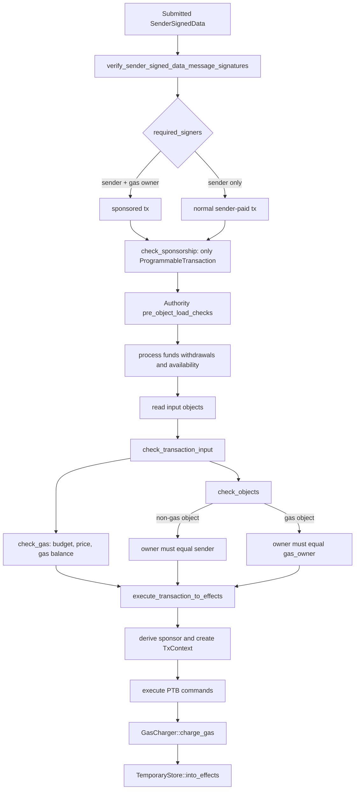
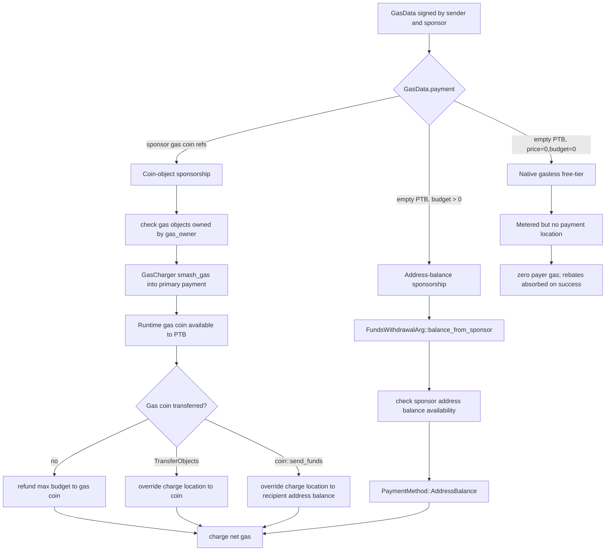
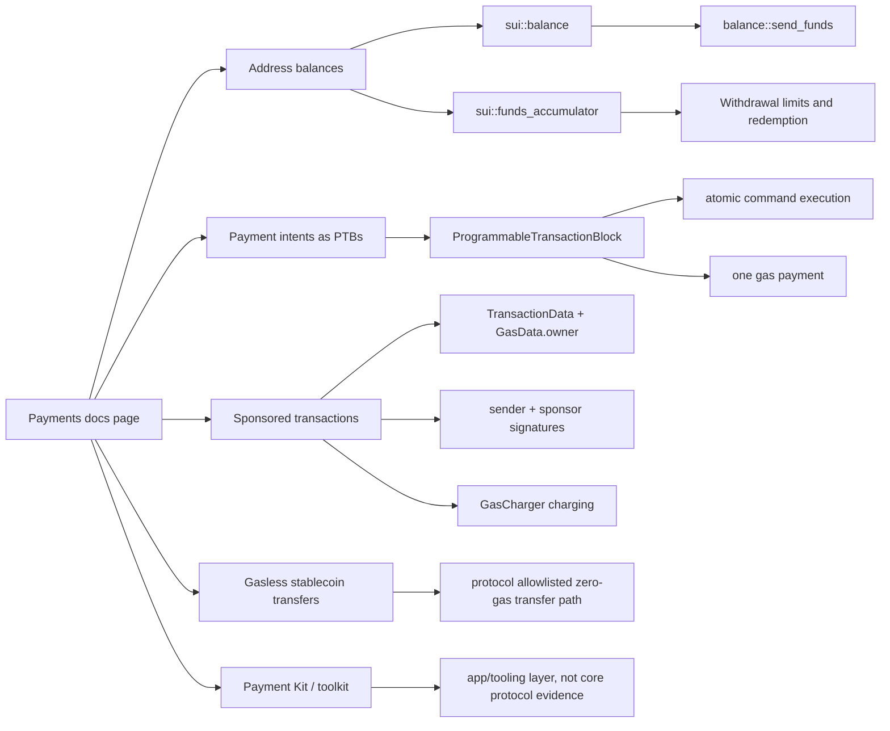

# Sui Payments 模块与 Sponsored Transaction 代码实现解析

## Executive Summary

Sui sponsored transaction 的核心不是一个独立的 "payment contract"，而是协议交易数据模型把业务发起方和 gas 付款方分开：`TransactionDataV1` 记录 `kind + sender + gas_data + expiration`，`GasData` 记录 `payment + owner + price + budget`。源码以 `gas_owner != sender` 定义 sponsored transaction，`required_signers()` 会把 sender 和 gas owner 都列为必需签名者；`SenderSignedTransaction` 的签名覆盖完整 `IntentMessage<TransactionData>`，包括 sponsor 填入的 gas owner、gas object/address-balance payment、gas price 和 budget。Primary evidence: `crates/sui-types/src/transaction.rs` lines 2288-2293, 2374-2379, 2969-2975, 3475-3500, 3659-3668; official docs: `docs/content/develop/transaction-payment/sponsor-txn.mdx` lines 23-61.

Sponsored transaction 与普通 sender-paid transaction 的关键分支发生在四处。第一，签名验证按 `required_signers()` 要求两方签名。第二，交易输入检查中，gas object 的 owner 按 `transaction.gas_owner()` 检查，非 gas owned inputs 仍按 `transaction.sender()` 检查。第三，执行引擎把 `GasData.owner` 派生为 optional sponsor 并注入 `TxContext`，Move 层可通过 `sui::tx_context::sponsor` 观察 sponsor。第四，gas charger 按 `PaymentKind` 区分 coin-object sponsorship、address-balance sponsorship、gasless free-tier 和 unmetered/system transaction。Primary evidence: `crates/sui-types/src/signature_verification.rs`, `crates/sui-transaction-checks/src/lib.rs`, `sui-execution/latest/sui-adapter/src/execution_engine.rs`, `sui-execution/latest/sui-adapter/src/gas_charger.rs`.

Gas 预授权和限额不是 off-chain allowance。链上可验证的 sponsor exposure 来自被两方签名固定的 `GasData.budget`、`GasData.price`、gas payment object refs 或 address-balance withdrawal reservation。`SuiGasStatus::check_gas_data` / `check_gas_balance` 检查 budget 上下限与可用 gas balance；address-balance gas 用 `gas_data.payment=[]`，并在 signing/preload 阶段生成 `FundsWithdrawalArg::balance_from_sponsor` 或 sender withdrawal。Gas 最终扣减发生在 `GasCharger::charge_gas`，失败时会 `drop_writes()` 重置业务写入，但仍按 gas model 结算计算/存储相关费用，除少数 address-balance withdrawal insufficient-funds 或 native gasless 特例。

"Payments" 需要分层表述。`docs/content/onchain-finance/payments.mdx` 是入口页，聚合 address balances、payment intents、transaction payment、sponsored transactions、gasless stablecoin transfers 和 Payment Kit；它不是 core sponsored transaction protocol。`sui::pay` 是 coin utility Move module，`coin.move` / `balance.move` / `funds_accumulator.move` 才提供 coin/balance/address-balance primitives。Payment intent 是 PTB pattern，其原子性来自 transaction execution semantics，而不是某个名为 Payments 的 on-chain sponsorship module。This draft intentionally separates `sui::pay`, payment intents/PTBs, address balances, and Payment Kit/docs-level payments pages.

## Item Findings

### item-1: TransactionData / GasData 数据结构与序列化边界

**Core claim.** Sui 把业务 sender 和 gas sponsor 分离在 `TransactionDataV1.sender` 与 `TransactionDataV1.gas_data.owner`，但最终签名边界是完整 `IntentMessage<TransactionData>`。这意味着 sender 和 sponsor 签的是同一份完整交易 bytes；任何一方签名后，第三方不能替换 gas owner、gas payment、price 或 budget 而保持签名有效。

**Primary code paths.**

- `crates/sui-types/src/transaction.rs::GasData` lines 2288-2293: `payment`, `owner`, `price`, `budget`.
- `crates/sui-types/src/transaction.rs::TransactionDataV1` lines 2374-2379: `kind`, `sender`, `gas_data`, `expiration`.
- `TransactionDataAPI::required_signers` implementation lines 2969-2975: always sender, plus gas owner if different.
- `TransactionDataAPI::gas_owner` lines 2982-2984 and `is_sponsored_tx` lines 3475-3478.
- Sponsored constructors: `new_with_gas_coins_allow_sponsor` lines 2441-2459, `new_transfer_sui_allow_sponsor` lines 2569-2590, `new_programmable_allow_sponsor` lines 2769-2785.
- `SenderSignedData` / `SenderSignedTransaction` lines 3659-3668: an `IntentMessage<TransactionData>` plus participant signatures, order-independent and participant-only.

**Data model.**

`GasData.payment` has two meanings that must not be conflated. When non-empty, it lists gas payment object refs. In coin-object sponsorship, those object refs are sponsor-owned SUI coin objects. When empty and the transaction kind is a programmable transaction, `is_gas_paid_from_address_balance()` returns true; gas is paid from the `GasData.owner` address balance. If `price == 0` too, `is_gasless_transaction()` returns true, but that native gasless path is a separate protocol mode from ordinary paid sponsorship (`transaction.rs` lines 2304-2317).

`check_sponsorship()` enforces a scope constraint: if `gas_owner == sender`, it is not sponsored; if different, the transaction kind must be `ProgrammableTransaction`, otherwise the code returns `UnsupportedSponsoredTransactionKind` (`transaction.rs` lines 3491-3500). This is why a sponsored stablecoin payment should be modeled as a PTB, not as arbitrary system/single-purpose transaction kinds.

**Docs boundary.**

The official sponsored transaction docs show the same `SenderSignedTransaction`, `TransactionDataV1`, and `GasData` shapes and state that sponsored transaction signatures include the whole `TransactionData`, including `GasData` (`docs/content/develop/transaction-payment/sponsor-txn.mdx` lines 23-61). The docs also introduce `GasLessTransactionData`, but explicitly call it an interface between user and sponsor, not a `sui-core` data structure (`sponsor-txn.mdx` lines 79-82). It should therefore be treated as an SDK/service API convenience, not a protocol struct.

**Evidence strength.** High. The Rust data model and official docs match.

### item-2: Sponsored Transaction 签名验证与交易输入验证路径

**Core claim.** Admission validates sponsored transactions by requiring a signature from each `required_signer`, then checking that gas inputs belong to gas owner while non-gas object inputs belong to sender. There is no special rule that lets the sponsor authorize mutation of the sender's non-gas objects.

**Control flow.**

1. Signed transaction carries `SenderSignedData`, whose inner `SenderSignedTransaction` contains the transaction intent and `tx_signatures`.
2. `verify_sender_signed_data_message_signatures()` loads `required_signers` from `txn.intent_message().value.required_signers()` and requires the number of signatures to match (`crates/sui-types/src/signature_verification.rs` lines 130-149).
3. For each required signer, it maps signatures by signer/alias and errors when a required signature is absent (`signature_verification.rs` lines 158-180).
4. `TransactionDataV1::validity_check` eventually calls `check_sponsorship()`; sponsored non-PTB transaction kinds are rejected (`transaction.rs` lines 3470-3500).
5. `sui-transaction-checks::check_transaction_input()` computes gas status, checks objects, replay protection, receiving objects, and package verification (`crates/sui-transaction-checks/src/lib.rs` lines 80-105 and 215-245).
6. `check_gas()` builds `SuiGasStatus`, loads gas coin objects or address-balance reservation amounts, and enforces gas object validity and budget/balance checks for non-gasless transactions (`lib.rs` lines 398-459).
7. `check_objects()` distinguishes gas objects from non-gas objects. If an object id is in transaction gas coins, the expected owner is `transaction.gas_owner()`; otherwise it is `transaction.sender()` (`lib.rs` lines 499-520).

**Sponsored-specific logic.**

The validation branch is concise but important. `required_signers()` changes when `gas_owner != sender`; `check_objects()` changes expected owner for gas coin object ids; address-balance gas changes gas payment loading because there are no object refs. Everything else remains a normal transaction validity path: package checks, receiving object checks, replay protection, deny checks, and object version checks still run.

`AuthorityState::pre_object_load_checks()` runs deny checks and `process_funds_withdrawals_for_signing()` before object loading. It then checks declared address-balance withdrawals are available, and for native gasless transactions checks minimum remaining balances (`crates/sui-core/src/authority.rs` lines 1004-1043). This applies to address-balance flows because `TransactionData::get_funds_withdrawal_for_gas_payment()` creates a sponsor withdrawal when gas is paid from address balance and sender differs from gas owner (`transaction.rs` lines 3603-3613).

**Gas payment mode.**

For coin-object sponsorship, `GasData.payment` contains sponsor-owned gas object refs. For address-balance sponsorship, `GasData.payment=[]`; `check_gas()` treats the available address-balance gas as the signed `gas_budget` because the scheduler has reserved it (`sui-transaction-checks/src/lib.rs` lines 424-427). For native gasless free-tier, `is_gasless` changes `SuiGasStatus` to a metered-but-free compute cap path and skips gas balance charging in `check_gas()` (`lib.rs` lines 411-418 and 449-458).

**Test anchors.**

- `crates/sui-core/src/unit_tests/authority_tests.rs::test_handle_sponsored_transaction` constructs a sender object, sponsor gas object, `GasData { owner: sponsor, ... }`, and a dual-signed transaction.
- `crates/sui-core/src/unit_tests/gas_tests.rs::test_invalid_gas_owners` covers invalid ownership combinations for gas coins.
- `crates/sui-core/src/unit_tests/transaction_deny_tests.rs` has sponsor-aware helper construction and denial paths.
- `crates/sui-e2e-tests/tests/gasless_tests.rs` covers native gasless validation, but those tests corroborate free-tier gasless, not ordinary sponsored transactions.

**Evidence strength.** High for signature/object/gas branches; medium for deny-list product interpretation because policy behavior depends on configured deny maps.

### item-3: Execution Engine 中 sponsor、TxContext 与对象所有权不变量

**Core claim.** Once a sponsored transaction passes admission, execution derives `sponsor = Some(gas_data.owner)` only when gas owner differs from sender, injects that sponsor into `TxContext`, and later checks ownership invariants against both sender and sponsor. Sponsor therefore becomes an authenticated transaction participant for gas and sponsor-origin address-balance withdrawals, but not a replacement owner for arbitrary sender objects.

**Primary code paths.**

- `sui-execution/latest/sui-adapter/src/execution_engine.rs::payment_kind` lines 91-124.
- `compute_input_reservations` lines 127-170.
- `execute_transaction_to_effects` lines 177-310.
- `crates/sui-framework/packages/sui-framework/sources/tx_context.move::sponsor` lines 57-60 and `native_sponsor` wrapper lines 232-236.

**Control flow.**

`execute_transaction_to_effects()` receives already checked input objects, `GasData`, `SuiGasStatus`, and `TransactionKind`. It creates `TemporaryStore`, derives sponsor by comparing `gas_data.owner` with `transaction_signer`, and passes the sponsor into `TxContext::new_from_components()` along with sender, digest, epoch, gas price, gas budget and protocol config (`execution_engine.rs` lines 220-249).

The same function builds `GasCharger` from `payment_kind(&gas_data, &transaction_kind, protocol_config)`. That helper maps:

- unmetered/system transaction to `PaymentKind::unmetered()`;
- native gasless transaction to `PaymentKind::gasless()`;
- empty `gas_data.payment` to `PaymentMethod::AddressBalance(gas_data.owner, gas_data.budget)`;
- non-empty `gas_data.payment` entries to either address-balance reservation methods or coin-object methods (`execution_engine.rs` lines 91-124).

Before execution, `compute_input_reservations()` totals funds-accumulator reservations. For PTB `FundsWithdrawalArg`, `WithdrawFrom::Sender` maps to transaction signer and `WithdrawFrom::Sponsor` maps to `gas_data.owner`. It also reserves gas budget under `(gas_data.owner, Balance<SUI>)` when gas is paid from address balance (`execution_engine.rs` lines 127-170). This is the execution-layer bridge between signed `GasData.owner` and address-balance accounting.

After Move execution and gas charging, expensive-check mode invokes `TemporaryStore::check_ownership_invariants(&transaction_signer, &sponsor, &gas_charger, ...)` (`execution_engine.rs` lines 297-307). This is a defense-in-depth check that effects preserve sender/sponsor ownership rules.

**Move visibility.**

Move code can observe sponsor with `sui::tx_context::sponsor(&TxContext): Option<address>` (`tx_context.move` lines 57-60). This is a native value wired from the execution `TxContext`; it is not a Move-level signature check. Protocol validation has already decided whether sponsor exists.

**Atomicity setup.**

`TemporaryStore` accumulates written/deleted objects and accumulator events during execution. It has `drop_writes()` to clear business writes and PTB-emitted accumulator ranges (`temporary_store.rs` lines 503-507), and `into_effects()` later creates the final effects from the store, gas summary, and execution status (`temporary_store.rs` lines 308-335). This temporary-store design is why gas charging can survive a failed PTB while business writes are reset.

**Evidence strength.** High. The execution adapter directly derives sponsor and passes it into TxContext and invariant checks.

### item-4: Gas metering、GasCharger 与 sponsor 预授权/限额机制

**Core claim.** Sponsor liability is bounded on-chain by signed gas data and validated balances/reservations: `GasData.budget`, `GasData.price`, gas object refs, and/or address-balance withdrawal reservations. There is no protocol object named "sponsor allowance"; any off-chain allowance, per-user quota, app policy, or rate limit is a Gas Station design layered above these signed fields.

**Gas status and balance checks.**

`check_gas()` reads `gas_budget`, `gas_price`, and whether gas is paid from address balance. For non-gasless transactions it calls `SuiGasStatus::new(gas_budget, gas_price, reference_gas_price, protocol_config)` and later `check_gas_objects()` and `check_gas_balance()` (`sui-transaction-checks/src/lib.rs` lines 398-459).

`SuiGasStatus::check_gas_data()` in `crates/sui-types/src/gas_model/gas_v2.rs` enforces:

- gas budget must not exceed max;
- gas budget must not fall below minimum transaction cost;
- available gas balance, summed from gas coin objects plus address-balance reservation amount, must be at least gas budget (`gas_v2.rs` lines 354-386).

`SuiGasStatus::new()` also rejects gas price below reference gas price and, when enabled, prices above max gas price (`crates/sui-types/src/gas.rs` lines 68-103). Native gasless is special: `check_gas()` uses a compute cap based on `gasless_max_computation_units * reference_gas_price` but no gas balance check (`sui-transaction-checks/src/lib.rs` lines 411-418 and 449-458).

**GasCharger payment model.**

`GasCharger` combines gas metering state and payment source metadata (`gas_charger.rs` lines 32-42). Its internal `PaymentMetadata` has three modes: `Unmetered`, `Gasless`, and `Smash`. `PaymentMethod` is either a coin object or `AddressBalance(address, reservation)`, and `PaymentLocation` is either `Coin(object_id)` or `AddressBalance(address)` (`gas_charger.rs` lines 44-107).

When created with `PaymentKind::Smash`, `GasCharger::new()` selects the first payment method as target, then calls `SmashMetadata::smash_gas()` (`gas_charger.rs` lines 123-145). `smash_gas()` sums coin values and address-balance reservations into `total_smashed`; for coin methods it verifies the input object is a gas coin and reads its coin value (`gas_charger.rs` lines 549-590). The PTB builder docs describe the user-facing equivalent: multiple gas coins are merged down to a single gas coin and all but one gas object are deleted, with the 0-index coin as merge target (`docs/content/develop/transactions/ptbs/building-ptb.mdx` lines 207-219).

**Charging and failure behavior.**

`GasCharger::charge_gas()` is the final gas accounting entry point. It bucketizes computation, resets writes on execution errors, collects storage/rebate, handles storage out-of-gas edge cases, and then deducts or credits the gas payment location (`gas_charger.rs` lines 336-456 and 486-540). Important branches:

- On execution error, it calls `reset()`, which invokes `temporary_store.drop_writes()` and re-smashes gas (`gas_charger.rs` lines 328-334 and 375-378).
- If payment is address balance and the error is `InsufficientFundsForWithdraw`, it returns zero gas cost summary (`gas_charger.rs` lines 394-408). This is a narrow edge case, not the general sponsored failure rule.
- If there is no payment location, it asserts this is native `PaymentMetadata::Gasless`; failed gasless returns zero cost summary, successful gasless absorbs destroyed-coin storage rebate into network fees (`gas_charger.rs` lines 420-442).
- Otherwise it applies net gas usage to the coin or address-balance payer.

**Sponsor preauthorization.**

For address-balance gas, `TransactionData::get_funds_withdrawal_for_gas_payment()` creates `FundsWithdrawalArg::balance_from_sponsor(gas_budget, SUI)` when sender differs from gas owner (`transaction.rs` lines 3603-3613). `FundsWithdrawalArg` records a `Reservation`, type arg, and `WithdrawFrom::{Sender,Sponsor}`; `owner_for_withdrawal()` maps sponsor withdrawal to `tx.gas_owner()` (`transaction.rs` lines 187-229). Signing/preload checks call `process_funds_withdrawals_for_signing()` and `check_amounts_available()` before object loading (`authority.rs` lines 1004-1033). That is the protocol preauthorization path.

**Evidence strength.** High. Budget, price, balance, and charging are explicit in source.

### item-5: Gas 对象选择、smashing、转移与回收生命周期

**Core claim.** In sponsored scenarios, the gas payment source lifecycle depends on whether sponsor uses coin objects, first-class address-balance gas (`payment=[]`), or legacy coin-reservation compatibility. Coin-object gas is object-version sensitive and smashed into a primary payment source; address-balance gas avoids gas object locking but shifts accounting to funds-accumulator reservations and accumulator events.

**Lifecycle: coin-object sponsorship.**

1. Sponsor selects one or more SUI gas coin object refs and fixes them in `GasData.payment`.
2. Sender and sponsor sign the full transaction bytes; object refs are now immutable within the signed payload.
3. Input checks load gas coin objects and require them to be valid gas objects owned by `transaction.gas_owner()` (`sui-transaction-checks/src/lib.rs` lines 420-457 and 499-520).
4. Execution `payment_kind()` maps each non-reservation gas payment entry to `PaymentMethod::Coin(ObjectRef)` (`execution_engine.rs` lines 109-118).
5. `GasCharger::new()` smashes payment methods into one target; `SmashMetadata::smash_gas()` sums values and ensures each coin method is actually a gas coin (`gas_charger.rs` lines 123-145 and 549-590).
6. PTB execution may transfer the gas coin. `GasCoinTransfer` tracks whether the runtime gas coin was sent by `TransferObjects` or `sui::coin::send_funds` (`static_programmable_transactions/execution/context.rs` lines 194-206).
7. `finish_gas_coin()` refunds the max budget to the current gas location and may override final charge location to a transferred coin or address balance recipient (`context.rs` lines 1689-1778).
8. `GasCharger::charge_gas()` applies final net gas usage.

**Lifecycle: address-balance sponsorship.**

For first-class address-balance gas, `GasData.payment` is empty. Official docs say `setGasPayment([])` means use address balance for gas, and in sponsored address-balance flow the user signs first, sponsor signs later, and both signatures are submitted (`docs/content/onchain-finance/asset-custody/address-balances/using-address-balances.mdx` lines 220-259 and 303-342). Source maps this to `PaymentMethod::AddressBalance(gas_data.owner, gas_data.budget)` (`execution_engine.rs` lines 102-107) and to a sponsor SUI funds withdrawal when sender differs from gas owner (`transaction.rs` lines 3603-3613). Storage rebates for sponsored address-balance gas are credited to sponsor address balance per docs (`using-address-balances.mdx` line 342).

**Coin-reservation compatibility limit.**

The coin-reservation compatibility layer synthesizes fake object refs for old clients. The design doc is explicit that gas coin reservations can pay from a sender's address balance but sponsorship is not allowed through that legacy gas-reservation path: "gas_owner == sender - sponsorship is not supported via coin reservations." Native `FundsWithdrawalArg::balance_from_sponsor` does support sponsorship; the restriction is specific to the fake object-ref compatibility path (`crates/sui-core/src/accumulators/design_docs/coin_reservations.md`, section 3.3).

**Failure and concurrency risks.**

Coin-object sponsorship inherits Sui owned-object version semantics. Official docs warn that if another inflight transaction already uses a gas object version, the sponsored transaction can be rejected and may need rebuilt/resigned; conflicting reservations can equivocate an object until next epoch (`docs/content/develop/transaction-payment/sponsor-txn.mdx` lines 159-173). Address-balance gas avoids this gas coin inventory/object-locking risk, but still needs balance availability, reservation accounting, expiration/replay protection, and accumulator-event reconciliation.

**Evidence strength.** High for source lifecycle. Medium for operational concurrency policy because source verifies object refs but pool reservation strategy is off-chain Gas Station engineering.

### item-6: Payments / payment intent / Move coin 模块核心逻辑

**Core claim.** "Payments" in Sui docs is an umbrella product/documentation category, not a single sponsored-payment protocol module. On-chain primitives relevant to stablecoin payments are `sui::pay` coin utilities, `sui::coin`, `sui::balance`, `sui::funds_accumulator`, and `sui::tx_context`; payment intents are PTB composition patterns whose atomicity comes from transaction execution.

**Layer separation.**

| Layer | Evidence | Role in gasless/sponsored payments |
|---|---|---|
| Payments docs page | `docs/content/onchain-finance/payments.mdx` lines 1-60 | Landing/guide page linking address balances, payment intents, transaction payment, sponsored transactions, gasless stablecoin transfers, Payment Kit. Not protocol evidence by itself. |
| `sui::pay` Move module | `crates/sui-framework/packages/sui-framework/sources/pay.move` lines 4-72 | Wallet/coin utility functions: keep, split, split-and-transfer, join, join_vec_and_transfer. It does not define sponsor validation or gas charging. |
| `sui::coin` | `coin.move` lines 125-178 | Coin wrapper and address-balance conversion helpers: `into_balance`, `from_balance`, `put`, `redeem_funds`, `send_funds`. |
| `sui::balance` | `balance.move` lines 70-122 | Balance arithmetic and `send_funds` / `redeem_funds` for address-balance transfers. |
| `sui::funds_accumulator` | `funds_accumulator.move` lines 40-73 | Withdrawal owner/limit helpers and split/join of withdrawal limits. |
| `sui::tx_context` | `tx_context.move` lines 57-60 and 232-236 | Exposes optional sponsor address to Move. |
| Payment intent docs | `docs/content/onchain-finance/payment-intents.mdx` lines 1-40 and 73-89 | PTB pattern: one signature, one gas payment, all operations execute or revert as one unit. Not a Move framework contract. |

**Move module role.**

`sui::pay` is explicitly described as handy functionality for wallets and `sui::Coin` management (`pay.move` line 4). It splits, joins, and transfers coins. It is not the protocol layer that decides whether sponsor can pay gas. Conversely, `coin::send_funds` converts a `Coin<T>` into `Balance<T>` and calls `balance::send_funds`; `balance::send_funds` deposits a `Balance<T>` into the recipient's funds accumulator (`coin.move` lines 175-178 and `balance.move` lines 101-109). These are the core Move paths for address-balance payments.

**Payment intent role.**

Payment intents are PTBs. The docs say a payment intent bundles multiple operations into a single atomic transaction and that if any operation fails, the whole batch reverts (`payment-intents.mdx` lines 7-18 and 73-89). They also mention sponsored gas as an app-level option (`payment-intents.mdx` line 27). This is useful product evidence, but it should not be cited as proof of core sponsored transaction validation unless paired with the Rust transaction/execution code above.

**Payment Kit caveat.**

The payments landing page links Payment Kit and describes it as a payment processing toolkit (`payments.mdx` lines 54-58). This draft does not use Payment Kit as protocol evidence because the outline review caveat explicitly requires separating marketing/toolkit flows from core sponsored transaction code.

**Evidence strength.** High for layer separation and Move module roles.

### item-7: Token transfer + sponsor 付 gas 的原子性与失败语义

**Core claim.** A sponsored payment PTB commits business token transfers and sponsor gas accounting in one transaction effects set. If Move execution fails, business writes are reset, but gas charging can still occur according to `GasCharger` and `SuiGasStatus`. Therefore product copy should say "token transfer does not partially commit," not "failure is free for the sponsor."

**Execution semantics.**

During execution, PTB commands mutate `TemporaryStore`. If a Move abort or execution error occurs, `GasCharger::charge_gas()` observes `execution_result.is_err()` and calls `reset()`, which drops writes and re-smashes gas (`gas_charger.rs` lines 336-378). `TemporaryStore::drop_writes()` clears recorded object writes/deletes and PTB-emitted accumulator event ranges (`temporary_store.rs` lines 503-507). The status passed into effects is failure when execution result is error (`execution_engine.rs` lines 276-280), and `TemporaryStore::into_effects()` builds final effects with the gas summary and status (`temporary_store.rs` lines 308-335).

This matches the payment-intent docs' user-facing statement that PTB operations execute as a unit and failures revert the batch (`docs/content/onchain-finance/payment-intents.mdx` lines 7-18 and 73-89), with the critical nuance that gas remains governed by the gas model.

**Failure matrix.**

| Scenario | Business token writes | Gas result |
|---|---|---|
| Successful sponsored PTB with gas coin | Token/object/address-balance changes commit | Sponsor gas coin/location charged net gas; rebates handled in gas summary |
| Move abort in sponsored PTB | Business writes dropped | Sponsor generally still charged computation/input/storage-related gas according to gas model |
| Storage out-of-gas while charging | Writes reset and storage/rebate charging retried or adjusted | Sponsor may be charged budget/rebate-adjusted amount depending on gas model branch |
| Address-balance withdrawal insufficient funds | Business execution fails | `charge_gas()` returns default gas summary if gas payment is address balance and error is `InsufficientFundsForWithdraw` (`gas_charger.rs` lines 394-408) |
| Native gasless transaction failure | Business writes fail/drop | No payer payment location; failed gasless returns zero gas summary (`gas_charger.rs` lines 420-428) |

**Atomicity boundary.**

The atomicity guarantee is at transaction effects level, not at "all attempted costs are undone." Effects can include a failed execution status and gas cost summary even when business writes do not commit. For stablecoin payments, this means sponsor-funded user operations can safely avoid partial transfer/deposit/swap state, while Gas Station accounting must still expect failed-user-action gas spend.

**Evidence strength.** High. The reset/charge/effects path is explicit in execution code.

### item-8: SDK / API construction evidence and test coverage anchors

**Core claim.** SDK and example code construct sponsored transactions by first isolating the PTB kind or full transaction, then setting sender, gas owner, gas payment/budget, collecting both signatures, and submitting both signatures. SDK examples corroborate the protocol data model but do not replace Rust source as primary evidence.

**SDK/docs construction evidence.**

- Sponsored transaction docs show `tx.setGasOwner(sponsor.toSuiAddress())`, `tx.setGasBudget(...)`, `tx.setGasPayment([...])`, both parties signing the same bytes, then `client.executeTransaction({ transaction: bytes, signatures: [userSig.signature, sponsorSig.signature] })` (`docs/content/develop/transaction-payment/sponsor-txn.mdx` lines 187-223).
- PTB builder docs show sponsored PTBs using `onlyTransactionKind`, `Transaction.fromKind(kindBytes)`, `setSender`, `setGasOwner`, and `setGasPayment` (`docs/content/develop/transactions/ptbs/building-ptb.mdx` lines 249-268).
- Address-balance docs show `tx.setGasPayment([])` for address-balance gas, the Rust `GasData { payment: vec![], owner, price, budget }`, and sponsored address-balance flow where both sender and sponsor sign (`docs/content/onchain-finance/asset-custody/address-balances/using-address-balances.mdx` lines 220-259 and 303-342).
- The local sponsored transaction dapp example reconstructs a sponsored tx from kind bytes, sets sender/gas owner/gas payment, signs with sponsor key, then the UI asks the user wallet to sign and submits both signatures (`dapps/sponsored-transactions/src/utils/sponsorTransaction.ts` lines 11-42 and `dapps/sponsored-transactions/src/App.tsx` lines 80-129).

**Test anchors.**

- `crates/sui-core/src/unit_tests/authority_tests.rs::test_handle_sponsored_transaction` validates sponsored transaction handling with sponsor-owned gas.
- `crates/sui-core/src/unit_tests/gas_tests.rs::test_invalid_gas_owners` checks gas owner rules.
- `crates/sui-core/src/unit_tests/transaction_deny_tests.rs` includes sponsored transaction construction and denial paths, including sponsor-account deny behavior.
- `crates/sui-e2e-tests/tests/gasless_tests.rs` covers native gasless free-tier success, dry run/simulate, disabled rejection, paid tx coexistence, computation cap, nonzero budget rejection, coin input restrictions, and rate limiting. These are not ordinary sponsored-transaction tests but are useful to avoid confusing native gasless with paid sponsorship.

**Evidence strength.** Medium-high. SDK/docs/examples are official or in-repo; tests corroborate source behavior but are not normative.

## Diagrams

### diag-1: Sponsored Transaction 数据结构关系图

```mermaid
flowchart TD
    SSD[SenderSignedData] --> SST[SenderSignedTransaction]
    SST --> IM[IntentMessage<TransactionData>]
    SST --> SIGS[tx_signatures: participant signatures]
    IM --> TD[TransactionData::V1]
    TD --> KIND[TransactionKind / ProgrammableTransaction]
    TD --> SENDER[sender: SuiAddress]
    TD --> GAS[GasData]
    TD --> EXP[expiration]
    GAS --> PAY[payment: Vec<ObjectRef>]
    GAS --> OWNER[owner: gas owner / sponsor]
    GAS --> PRICE[price]
    GAS --> BUDGET[budget]
    TD --> RS[required_signers()]
    RS --> SENDER
    RS -->|if owner != sender| OWNER
    SIGS -->|each signature signs| IM
    PAY -->|non-empty| GASCOIN[sponsor-owned gas coin objects]
    PAY -->|empty PTB| AB[address-balance gas]
```

### diag-2: Sponsored Transaction 验证与执行路径



### diag-3: Gas payment source lifecycle



### diag-4: Payments concept map



## Source Coverage

| Requirement | Coverage | Evidence |
|---|---|---|
| src-1 Rust protocol/source evidence | Covered | `crates/sui-types/src/transaction.rs`, `signature_verification.rs`, `crates/sui-transaction-checks/src/lib.rs`, `crates/sui-core/src/authority.rs`, `sui-execution/latest/sui-adapter/src/execution_engine.rs`, `gas_charger.rs`, `temporary_store.rs`, `static_programmable_transactions/execution/context.rs`, `crates/sui-types/src/gas.rs`, `crates/sui-types/src/gas_model/gas_v2.rs` |
| src-2 Sui Framework Move evidence | Covered | `pay.move`, `coin.move`, `balance.move`, `tx_context.move`, `funds_accumulator.move` |
| src-3 official docs | Covered | Sponsored Transactions, Payment Intents, Payments, PTB builder, Using Address Balances |
| src-4 tests | Covered | `authority_tests.rs::test_handle_sponsored_transaction`, `gas_tests.rs::test_invalid_gas_owners`, `transaction_deny_tests.rs`, `gasless_tests.rs` |
| src-5 upstream dependency | Covered | `sui-gasless-mechanism/final.md` at main commit `27bfbd34617ad115ca052b731e5ff9e66eb5da32`; used only for context on gasless/free-tier distinction |
| src-6 SDK/API examples | Covered | `sponsor-txn.mdx`, `building-ptb.mdx`, `using-address-balances.mdx`, `dapps/sponsored-transactions` |

## Gap Analysis

1. **The approved outline file still has `status: candidate` in frontmatter.** The issue thread supplies the actual approval gate via Review Verdict comment `8ec7ece4-6797-4272-b791-a2dd4fc713c0` and Orchestrator's deep-draft dispatch. This draft records that gate in metadata instead of mutating the outline.
2. **Exact public TypeScript SDK source package is not vendored as a top-level `sdk/typescript/src` tree in this checkout.** Official docs and the in-repo sponsored dapp cover `setGasOwner`, `setGasPayment`, `onlyTransactionKind`, `signTransaction`, and execute submission patterns. For final polish, a reviewer may add an external SDK source permalink if required.
3. **Gas Station production API remains implementation-specific.** Sui docs provide role and flow examples, but the protocol source only proves signed transaction/gas semantics. Off-chain sponsor policy, allowance, rate limits, and billing must be designed by the operator.
4. **Native gasless stablecoin transfers are intentionally out of scope except as contrast.** This draft references gasless tests/source only to keep free-tier gasless separate from ordinary sponsored gas payment.
5. **Payment Kit is not used as protocol evidence.** This follows the outline-review caveat: Payment Kit and payments landing pages are app/tooling layers unless backed by primary code paths.

## Revision Log

| Round | Action | Notes |
|---|---|---|
| 1 | Initial deep draft | Produced from approved outline commit `c217060eb00ea385715df082fd15c2cf8da1e0f2`; carried review caveat separating `sui::pay`, payment intents/PTBs, address balances, Payment Kit/docs-level payments, and core sponsored transaction protocol evidence. |
